# Manual de uso — aplicativo desktop e bot do Telegram (v4.0)

Este manual cobre as duas formas de trabalhar com as faturas de **energia** (Equatorial, CHESP e borderôs) e de **água**
(Saneago e concessionárias municipais):

1. o **aplicativo desktop** *Processador de Faturas de Energia* (Windows), que transforma PDFs em planilhas Excel na sua
   máquina — sem internet, sem banco de dados;
2. o **bot do Telegram @doc_gEEstor_bot**, que guarda tudo num banco PostgreSQL na VM (uma organização por banco), responde
   consultas, gera planilhas, recebe PDFs novos e alimenta o Power BI.

As capturas de tela são do aplicativo real na versão 4.0.0 (16/09/2026).

---

## Parte 1 — Aplicativo desktop

### 1.1 Instalar e abrir

1. Baixe a versão mais recente em **Releases** do repositório
   ([github.com/ArturXCX/processador-faturas-energia/releases](https://github.com/ArturXCX/processador-faturas-energia/releases)):
   * `FaturasDeEnergia-Setup.exe` — instalador (recomendado; cria atalhos, não pede administrador), ou
   * `FaturasDeEnergia.zip` — versão portátil (extraia a pasta e abra `FaturasDeEnergia.exe`).
2. Rode o instalador a partir do **disco local** (não direto do Google Drive) — é bem mais rápido.
3. Não precisa de Python nem de Tesseract: o OCR já vem embutido (indicador **● OCR pronto** no canto superior direito).

### 1.2 Atualização obrigatória

Ao abrir, o aplicativo consulta a última versão publicada nas Releases do GitHub. Se houver uma versão mais nova, aparece
o aviso abaixo e o aplicativo fica bloqueado até você baixar e instalar a nova versão (botão **Baixar nova versão**; **Ver
no GitHub** abre a página da release; **Sair do aplicativo** fecha).

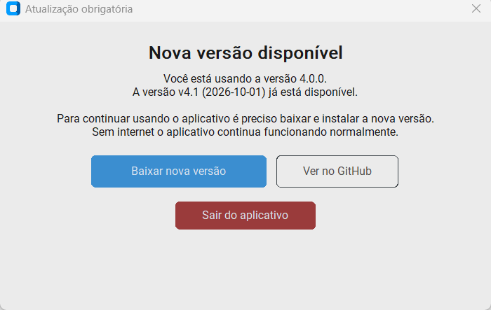

**Sem internet o aplicativo continua funcionando normalmente** — a verificação só bloqueia quando consegue confirmar que
existe versão mais nova. (Para quem faz capturas de tela ou testes: a variável de ambiente `FATURAS_SEM_ATUALIZACAO=1`
desliga a verificação.)

### 1.3 A janela principal

A tela tem dois **domínios** (abas de cima): **Energia Elétrica** e **Água**. Dentro de Energia Elétrica há o seletor
*Faturas de Energia / Borderôs de Energia*; cada conjunto tem as suas abas.

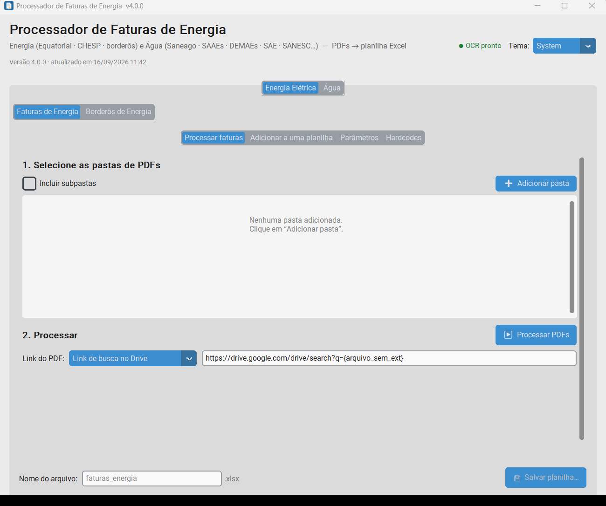

No canto superior direito ficam o indicador do OCR e o **tema** (System / Light / Dark). A versão e a data da build
aparecem sob o título.

### 1.4 Energia — Processar faturas

1. **Adicionar pasta**: escolha a pasta com os PDFs e informe a fornecedora (EQUATORIAL ou CHESP) em cada pasta adicionada.
   Marque *Incluir subpastas* se os PDFs estão separados por ano.
2. **Mapa de UCs (opcional)**: importe o dicionário de unidades consumidoras (JSON/xlsx) para preencher `id_uc_canonico`,
   unidade institucional, comarca etc.
3. **Link do PDF**: como preencher a coluna `link_pdf` (busca no Google Drive pelo nome do arquivo, caminho local ou modelo
   de URL).
4. **Processar** — a barra de progresso mostra o andamento; PDFs digitalizados (CHESP) passam por OCR e demoram mais.
   O log embaixo lista o que foi lido e os avisos da validação.
5. **Salvar planilha…** — escolha o nome e a pasta. A planilha sai com as abas `fatura_resumida`, `fatura`,
   `unidade_consumidora`, `itens_fatura`, `tarifas`, `impostos`, `medicao`, `medicao_resumida`, `validacao` e `glossario`.

O botão *Editar colunas* permite renomear/ocultar colunas e abas; esse "perfil" vai gravado numa aba oculta da planilha
e é respeitado quando você adiciona faturas novas depois.

### 1.5 Energia — Adicionar a uma planilha

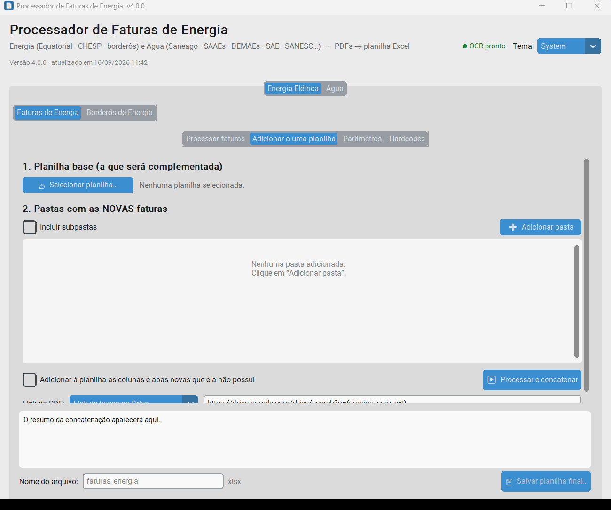

1. **Selecionar planilha…**: a planilha base (uma que o próprio app gerou, mesmo que você tenha renomeado colunas).
2. **Adicionar pasta**: as pastas com os PDFs **novos**.
3. **Processar e concatenar**: as faturas novas são traduzidas para o layout exato da planilha base e as repetidas
   (mesmo `id_fatura`) são descartadas. O resumo mostra quantas linhas entraram em cada aba.
4. **Salvar planilha final…**.

Se a planilha base não veio do app (sem metadados), o app sugere o mapeamento das colunas e abre uma tela de confirmação.

### 1.6 Energia — Parâmetros e Hardcodes

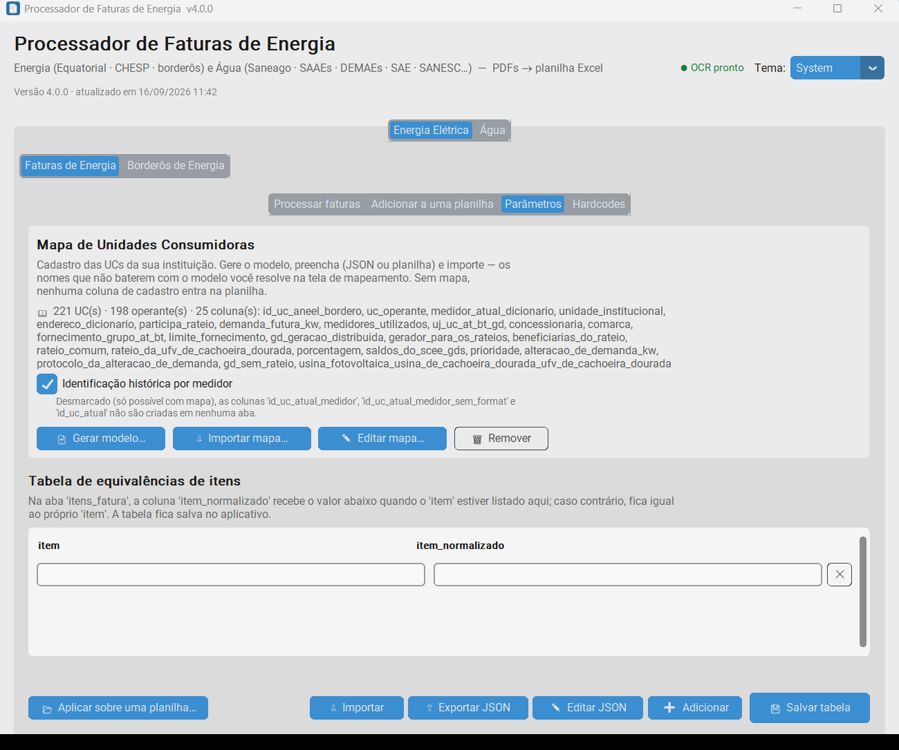

**Parâmetros** edita, em JSON, as listas usadas pela extração (itens informativos, equivalências de nomes de itens,
regras de validação…). **Hardcodes** cadastra regras *SE → ENTÃO* aplicadas só na planilha de saída (por exemplo,
corrigir uma classificação tarifária impressa errada numa UC específica).

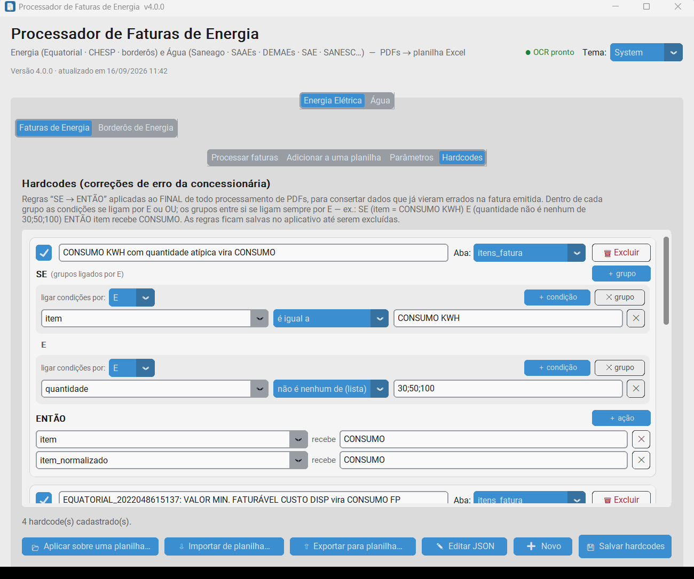

### 1.7 Energia — Borderôs

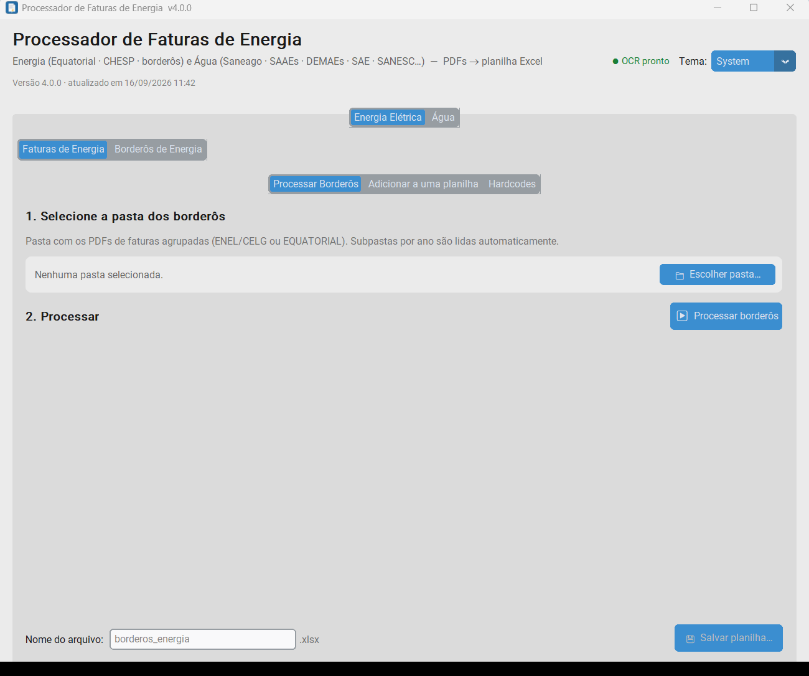

Selecione a pasta dos borderôs (faturas agrupadas da Equatorial/ENEL — subpastas por ano são lidas automaticamente) e
clique em **Processar borderôs**. Para cada borderô o log mostra a competência, a distribuidora, quantas contas foram
lidas e se a **soma das UCs bate com o total impresso** (✔ / ✗ / ○ = digitalizado). A planilha sai com as abas
`borderos`, `unidades` e `resumo_valores`. A aba *Adicionar a uma planilha* faz o mesmo para complementar uma planilha
de borderôs existente.

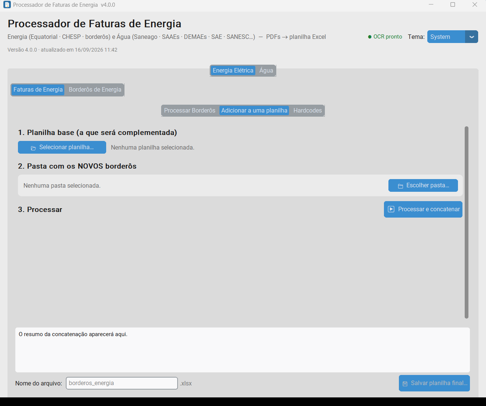

### 1.8 Água — Processar faturas de água (novo na 4.0)

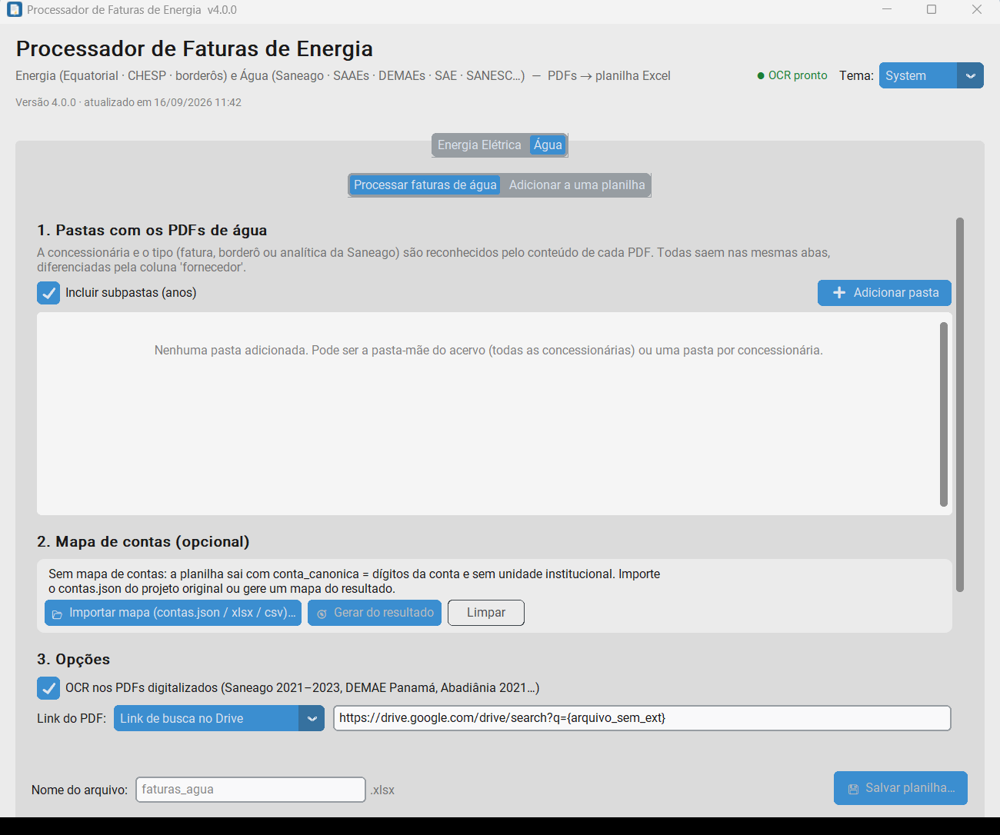

A aba **Água** aceita PDFs de **qualquer concessionária**; não é preciso dizer qual é: o app reconhece pelo conteúdo
(CNPJ e vocabulário) a concessionária e o tipo do documento — fatura individual, **borderô** da Saneago (fatura agrupada
do órgão, com várias contas e retenção de IRPJ) ou **fatura analítica** da Saneago (um bloco por conta). Todas saem nas
**mesmas abas**, diferenciadas pela coluna `fornecedor`.

1. **Pastas com os PDFs de água** — pode ser a pasta-mãe do acervo inteiro (todas as concessionárias, subpastas por ano)
   ou uma pasta por concessionária. *Incluir subpastas (anos)* vem marcado.
2. **Mapa de contas (opcional)** — cadastro *conta → unidade institucional / serviços*. Três botões:
   * **Importar mapa (contas.json / xlsx / csv)…** — o `contas.json` do projeto original ou uma planilha com colunas
     parecidas (CONTA_DV, CONTA, UNIDADE, ENDERECO, DISTRIBUIDORA, OPERANTE, AGUA, ESGOTO, SMRSU);
   * **Gerar do resultado** — depois de processar, monta o mapa a partir das próprias faturas (conta, fornecedor, nome,
     endereço, hidrômetro, serviços cobrados); processe de novo para a planilha sair com `conta_canonica` e
     `unidade_institucional`;
   * **Limpar** — remove o mapa ativo. O mapa fica em `%APPDATA%\FaturasEnergia\mapa_contas_agua.json`.
3. **Opções** — *OCR nos PDFs digitalizados* (Saneago 2021–2023, DEMAE Panamá, Abadiânia 2021…; desligue para ir mais
   rápido quando não há PDFs escaneados) e o **Link do PDF** (como na energia).
4. **Processar faturas de água** — barra de progresso, botão *Cancelar* (termina o PDF em andamento) e o log.

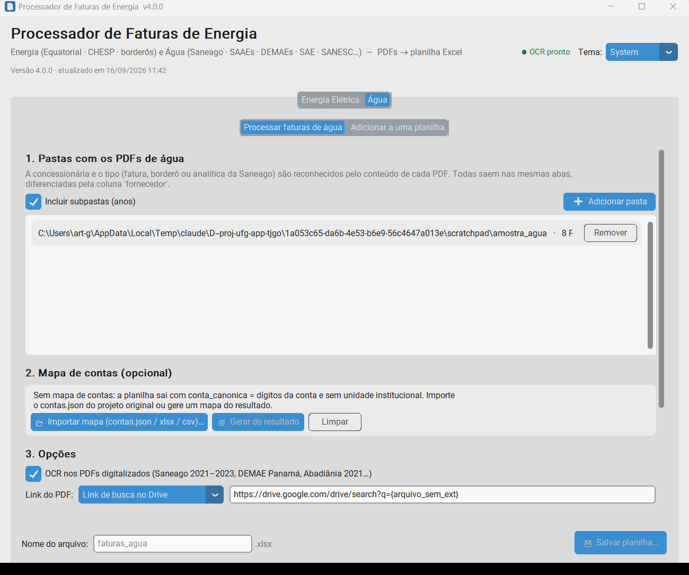

Ao terminar, o rodapé resume o lote e o log mostra, por borderô da Saneago, se a soma das contas confere com o total
impresso, e a quantidade de faturas por concessionária, além dos primeiros erros da validação:

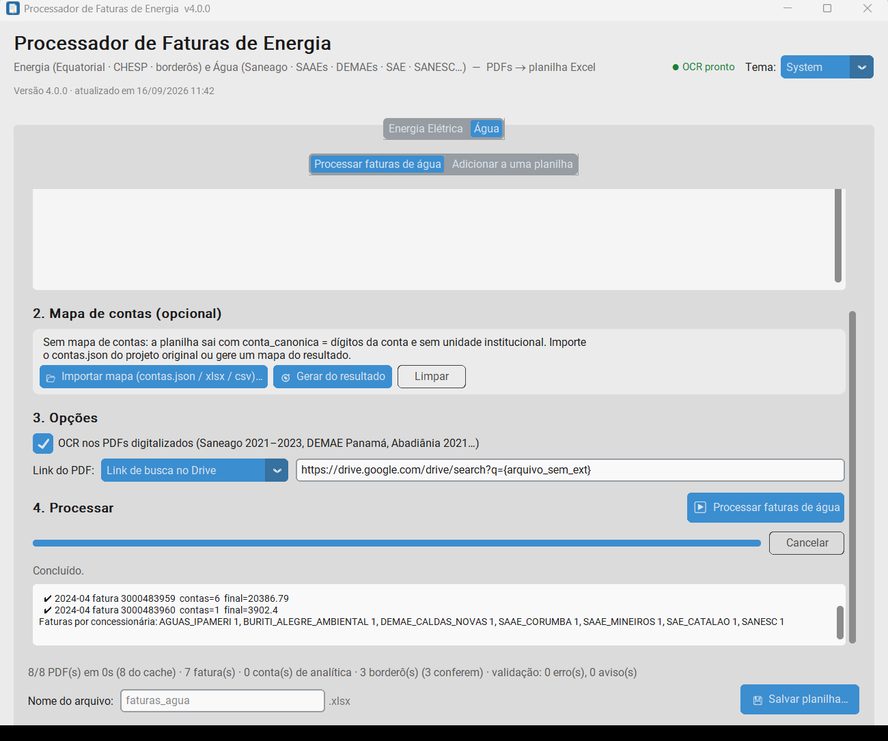

5. **Salvar planilha…** — abas `fatura_agua`, `itens_agua`, `historico_agua`, `borderos_agua`, `contas_bordero_agua`,
   `validacao_agua`, `mapa_contas_agua` (quando há mapa) e `glossario`.

O que significa cada coluna está na aba `glossario` da própria planilha. Pontos de atenção:

* `conta` traz o dígito verificador junto (1627885-2 → `16278852`); `conta_canonica` é a conta sem zeros à esquerda
  (ou a do mapa de contas); `id_fatura_agua` = `<FORNECEDOR>_<nº da fatura>` (SANESC, que não numera: conta + competência).
* `valor_agua` / `valor_esgoto` / `valor_taxas` / `valor_multa_juros` são somas dos lançamentos por categoria;
  `soma_itens` deve bater com `valor_total` (regra **ITENS_NAO_FECHAM** quando não bate).
* Borderô da Saneago: os valores por conta são **brutos**; `base_calculo` (água + esgoto) × `aliquota_irpj` (4,80 %) =
  `valor_retido`; `valor_final` é o que é pago. `bate_total` = a soma das contas confere com o total impresso.
* A fatura analítica e o borderô da Saneago são o **mesmo dinheiro** (detalhe × agrupado): a validação cruza os dois
  (**ANALITICA_DIVERGE_BORDERO**, **CONTA_SEM_ANALITICA**), mas não some os dois num total.
* PDFs digitalizados vêm marcados com `extraido_por_ocr = True` e a regra **LIDA_POR_OCR** — confira os valores.

### 1.9 Água — Adicionar a uma planilha

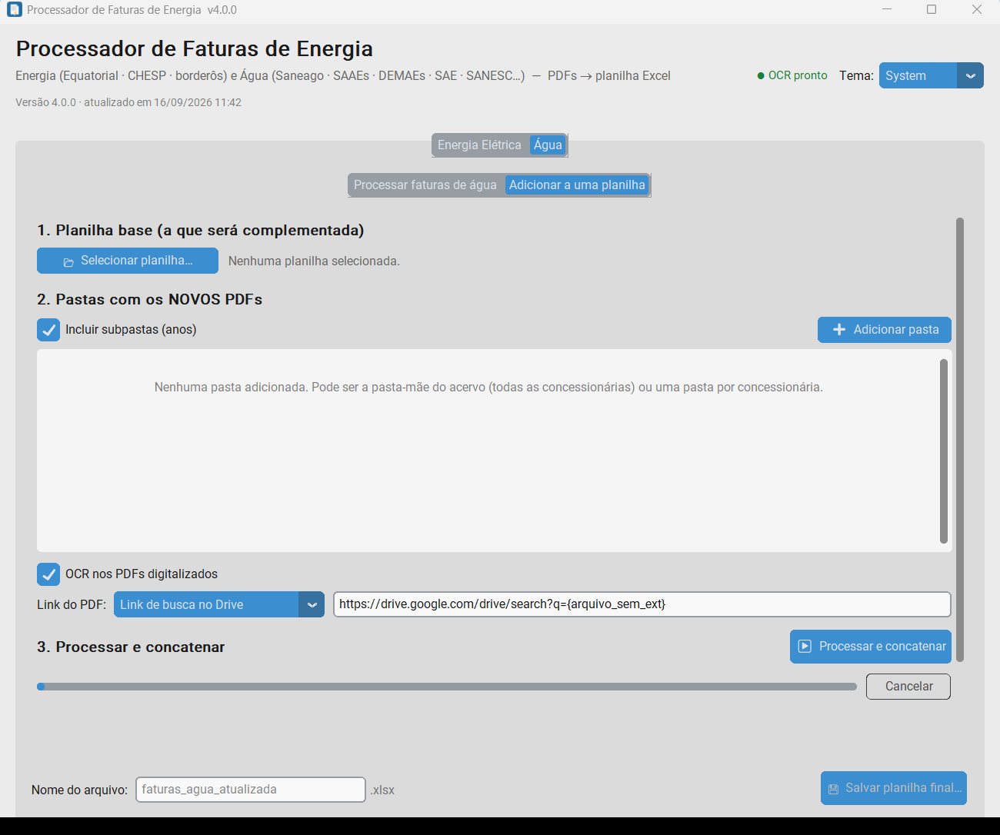

Igual ao fluxo de energia: planilha base de água + pastas com os PDFs novos → **Processar e concatenar** (repetidos, pelo
`id_fatura_agua`/`id_bordero_agua`, ficam de fora) → **Salvar planilha final…**.

### 1.10 Linha de comando (sem abrir o programa)

Na pasta do app há o `FaturasDeEnergiaCLI.exe` (ou, no código-fonte, `python -m faturas_app --cli`):

```bash
FaturasDeEnergiaCLI.exe --cli --pasta "D:\pdfs\equatorial=EQUATORIAL" --pasta "D:\pdfs\chesp=CHESP" --subpastas --saida D:\saida\faturas_energia.xlsx --csv D:\saida\csv
```

```bash
FaturasDeEnergiaCLI.exe --cli --agua "J:\Faturas-Outras-Distribuidoras" --agua "J:\Faturas-Saneago-Bordero" --saida D:\saida\faturas_agua.xlsx --csv D:\saida\csv_agua
```

Opções úteis: `--cache DIR` (só PDFs novos são lidos de novo), `--paralelo N`, `--mapa-uc ARQ` (energia),
`--mapa-contas ARQ` (água), `--sem-ocr` (água), `--log ARQ`. Não misture `--pasta` e `--agua` na mesma execução.

---

## Parte 2 — Bot do Telegram @doc_gEEstor_bot

O bot é a porta de entrada do banco de dados da sua organização (TJGO, UFG, Polícia Penal…). Um comando por mensagem;
`/ajuda` lista todos e `/ajuda <comando>` mostra o guia com **exemplos reais** dos dados da sua organização.

### 2.1 Entrar

* `/login` → usuário → senha → (em login compartilhado) quem está entrando → botões com as suas organizações.
* `/org` mostra/troca a organização ativa; `/senha` troca a sua senha; `/logout` sai.
* `/status` — situação geral: faturas e borderôs de energia, faturas de água por concessionária, validação, pendências.

### 2.2 Consultar energia

| Comando | O que faz |
|---|---|
| `/fatura <id ou número>` | resumo da fatura, itens, validação e o borderô em que ela aparece |
| `/uc <nome, local ou número>` | dados e últimas 12 faturas de uma unidade consumidora |
| `/mapa <uc>` · `/mapa editar <uc> <campo> <valor>` | cadastro da UC no mapa (edição só afeta as views) |
| `/borderos [AAAA ou AAAA-MM]` · `/bordero <id>` | borderôs de energia e o cruzamento com as faturas |
| `/validacao [REGRA]` | ocorrências da validação |
| `/hardcodes` · `/hardcodes menu` · `/hardcode ativar\|desativar <id>` | regras de correção (só nas views) |
| `/glossario <termo>` | significado de colunas, itens e regras |

### 2.3 Consultar água (novo)

| Comando | O que faz |
|---|---|
| `/agua` | resumo: faturas e borderôs por concessionária, competências, validação |
| `/agua fornecedores` | as concessionárias reconhecidas, CNPJ e quantas faturas há de cada |
| `/agua faturas <FORNECEDOR \| AAAA \| AAAA-MM>` | lista de faturas (ex.: `/agua faturas SAE_CATALAO`, `/agua faturas 2025-01`) |
| `/agua fatura <id \| nº \| conta AAAA-MM>` | uma fatura: água/esgoto/taxas, leituras, itens, histórico, validação |
| `/agua conta <conta \| nome>` · `/agua contas [FORNECEDOR]` | uma conta de água e as faturas dela; ou todas as contas |
| `/agua borderos [AAAA \| AAAA-MM]` · `/agua bordero <id \| AAAA-MM>` | borderôs da Saneago: IRPJ, valor final, contas e cruzamento com a analítica |
| `/agua validacao [REGRA]` | problemas encontrados nas faturas de água |
| `/agua resumo [AAAA]` | totais mensais por concessionária |

### 2.4 PDFs e planilhas

* `/pdf <id>` · `/pdf bordero <id>` · `/pdf agua <id>` — envia o PDF original; `/pdf menu` abre o navegador com filtros
  (tipo faturas / borderôs / água, fornecedora, ano, mês, UC), seleção múltipla e download em zip.
* `/pdfs [equatorial|chesp|borderos|agua] [AAAA ou AAAA-MM]` — contagens e listas de PDFs.
* `/exportar <view>` — planilha Excel de uma view; `/exportar planilha` (10 abas de energia), `/exportar planilha_borderos`,
  `/exportar planilha_agua` (11 abas: `agua_faturas`, `agua_itens`, `agua_historico`, `agua_borderos`, `agua_contas_bordero`,
  `agua_bordero_x_analitica`, `agua_resumo_mensal`, `agua_contas`, `agua_validacao`, `agua_glossario`, `agua_fornecedores`),
  `/exportar tudo`; `/exportar menu` escolhe as abas por botões. Filtros: `[AAAA-MM] [uc]`.
* `/query <SQL>` — SELECT ou CREATE/ALTER/DROP VIEW sobre as views (`views_faturas`, `views_borderos`, `views_agua` —
  **para água prefixe `views_agua.`**, porque `borderos`, `validacao`, `glossario` e `resumo_mensal` existem também na
  energia). `/query xlsx <SQL>` força o Excel. Sem SQL? `/gem` dá o link do assistente Gemini que monta a consulta.
* `/powerbi` — servidor, banco, usuário e senha de leitura da sua organização e o passo a passo (as views de água
  aparecem no schema `views_agua`).

### 2.5 Entrar com PDFs novos

Dois caminhos — em ambos a inserção no banco só acontece depois da **aprovação do administrador**:

1. **Pelo chat**: envie os PDFs (um por mensagem, até 20 MB). O bot reconhece cada um como fatura Equatorial/CHESP,
   borderô de energia ou **fatura de água (qualquer concessionária)**, monta o lote e responde `… adicionado ao lote
   (ÁGUA SAE_CATALAO)`. Depois `/processar iniciar`: os extratores rodam (PDFs digitalizados passam por OCR), o bot
   confere duplicidade (mesmo PDF, mesma fatura, mesma conta/competência) e se o PDF é mesmo da sua organização, envia
   as planilhas (`lote_N_lote.xlsx` energia, `lote_N_agua.xlsx` água) e pergunta se quer **pedir a inserção no banco**.
   `/processar pendentes` processa os PDFs detectados no servidor; `/processar cancelar` descarta o lote.
2. **Pelo Google Drive**: coloque os PDFs na pasta da organização — `faturas/equatorial`, `faturas/chesp`, `borderos/`
   e, para água, `agua/faturas`, `agua/borderos`, `agua/analiticas` — e mande `/importar` (`/importar verificar` só
   lista). Rejeitados vão para `rejeitados/` com o motivo em `rejeicoes_log.txt`; depois da aprovação os aceitos vão
   para `processados/AAAA-MM/`.

O administrador recebe a solicitação com os botões **Aprovar / Negar / Detalhes**; ao aprovar, o bot grava tudo no banco
da organização (tabelas de energia e de água), copia os PDFs para o repositório e recompila as views.

### 2.6 Outros

* `/ticket <texto>` — pedido em texto livre ao administrador (`/ticket erro <fatura> <o que está errado>` anexa os dados
  da fatura); `/tickets` acompanha.
* Texto livre (sem `/`) é interpretado pelo Gemini e vira um comando quando possível; senão vira um ticket.
* `/membro` — membros de um login compartilhado; `/clear` — apaga a conversa com o bot (os dados do banco não mudam).
* Administrador: `/usuario`, `/solicitacoes`, `/responder`, `/fechar`, `/org nova|editar`, `/recompilar`.

---

## Parte 3 — Desktop × bot: quando usar cada um

| | Aplicativo desktop | Bot @doc_gEEstor_bot |
|---|---|---|
| Onde roda | na sua máquina (Windows), sem internet | na VM (PostgreSQL), pelo Telegram |
| Entrada | pastas de PDFs | PDFs pelo chat ou pasta do Drive; acervo carregado pelo administrador |
| Saída | planilha Excel (+ CSV por aba na CLI) | respostas no chat, planilhas por `/exportar`, views para Power BI e `/query` |
| Energia | faturas Equatorial/CHESP, borderôs | idem, com cruzamento borderô × fatura e mapa de UCs no banco |
| Água | todas as concessionárias, mesma planilha; mapa de contas local | mesmas tabelas no banco (`tabelas_agua` / `views_agua`), `/agua`, cruzamento borderô × analítica |
| Histórico/auditoria | não (cada planilha é um arquivo) | sim: snapshots de toda escrita, auditoria dos comandos, aprovação do administrador |
| Correções | Parâmetros e Hardcodes locais | hardcodes por organização (só nas views), `/mapa editar`, tickets |
| Extrator | o mesmo código (`faturas_app`) | o mesmo código, chamado pelo bot na VM (`--cli`) |
